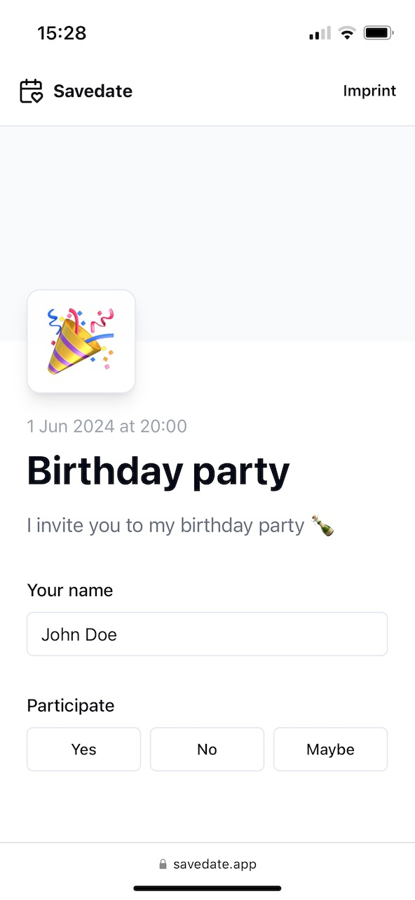
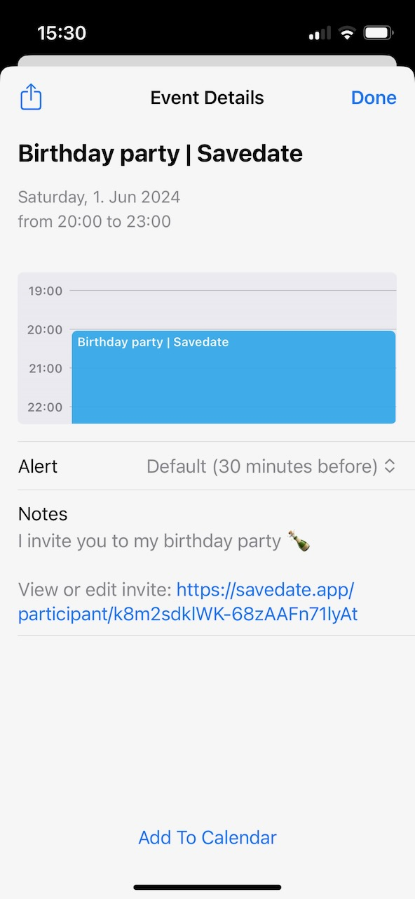

# Savedate

Send calendar invitations without registration. Using Astro DB, Temporal API, and Satori for social media image generation. Supports RSVP, response editing, optional image upload, and direct calendar import for Apple, Google, and Microsoft. Available at [savedate.app](https://savedate.app/).

## Screenshots

    
    
    

    
    
    

## Development

Clone the repository and run `npm install` and `npm run dev` for a local development environment. Astro DB will automatically set up a local database for you.

## Contributing

Feel free to submit reasonable changes like bugfixes or functional additions. I will look into and test every contribution and will accept it in case it provides value for the general community. When you are planning to make an extensive contribution, please first discuss the change you wish to make by creating an issue.

## License

This project is licensed under the MIT License — see the [LICENSE.md](LICENSE.md) file for details.
